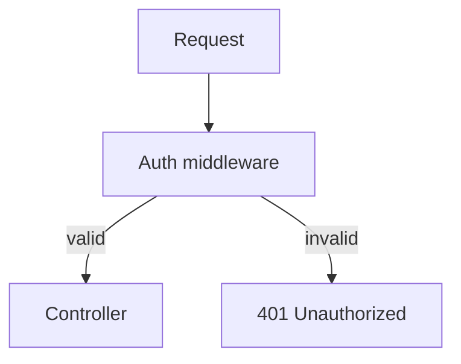
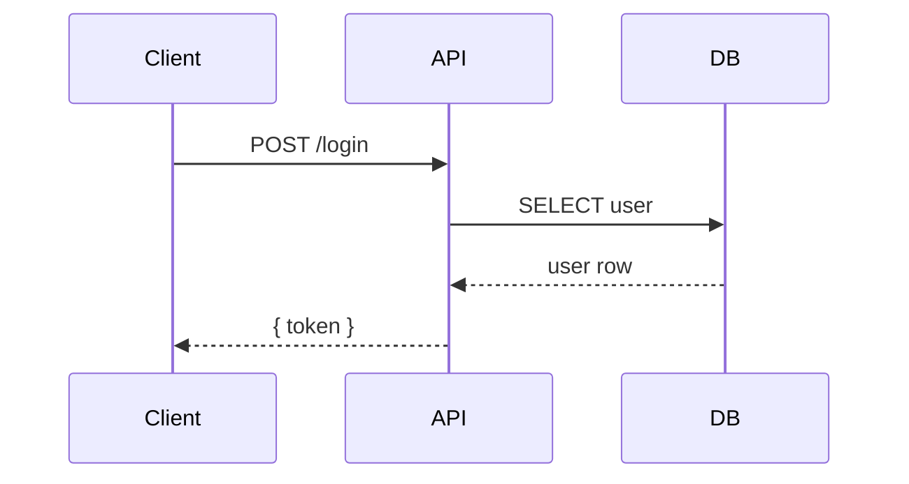
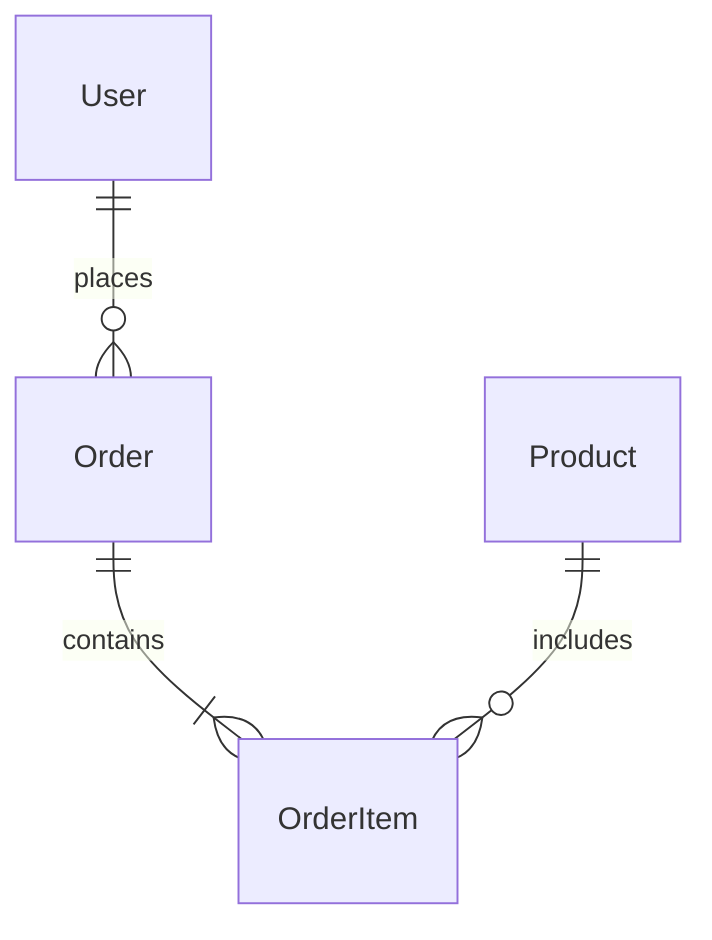

# Documentation

## When to use
- Writing or updating project README
- Creating API documentation or reference
- Recording ADRs (Architecture Decision Records)
- Maintaining changelog
- Syncing documentation with Obsidian vault
- Writing tutorials, how-to guides, or explanations

## Documentation framework: Diataxis

```
              ┌──────────────────────────────────────────┐
              │            USER GOAL                      │
              │                                          │
              │  Learning  │  Task-oriented               │
──────────────┼────────────┼──────────────────────────────┤
  STUDYING    │  Tutorial  │  How-to guide                │
              │  (learn)   │  (solve a problem)           │
──────────────┼────────────┼──────────────────────────────┤
  LOOKING UP  │  Explanation │  Reference                 │
              │  (understand)│  (look up info)            │
──────────────┴────────────┴──────────────────────────────┘
```

### Tutorial — learning by doing
- Follow a step-by-step scenario
- No assumptions about prior knowledge
- Concrete, working examples
- "Getting started", "Quickstart"

### How-to guide — solving a problem
- Specific, actionable steps
- Start from a real problem
- "How to reset a password"
- "How to deploy to production"

### Explanation — understanding concepts
- Background, context, rationale
- Diagrams and comparisons
- "Why we chose JWT over sessions"
- "How the caching layer works"

### Reference — looking up information
- Complete, accurate, up-to-date
- Structured for scanning (tables, headings)
- "API endpoint reference"
- "Configuration options"

## README template
```markdown
# Project Name

[Badges: build, coverage, version, license]

## Quick start
```bash
npm install && npm run dev
```

## Documentation
- [Getting started](docs/getting-started.md)
- [API reference](docs/api.md)
- [Contributing](CONTRIBUTING.md)

## Architecture
<!-- Brief diagram or link -->

## License
MIT
```

## Obsidian vault sync

When sync'ing with an Obsidian vault, follow these conventions:
- One file per entity (user story, task, decision, project)
- Use `[[wikilinks]]` to connect related entities for graph view
- Frontmatter for metadata (tags, dates, status)
- Mermaid for diagrams (compatible with Obsidian)
- Folder structure mirrors the domain model

### Example note
```markdown
---
title: Implement JWT Auth
type: task
project: ABC-123
status: completed
created: 2026-06-01
---

## Description
Add JWT authentication with access + refresh tokens.

## Related
- [[ABC-123 Project]]
- [[ADR-001 JWT strategy]]
- [[User authentication PRD]]
```

## ADR template
```markdown
# ADR-{NNN}: {Title}

## Context
What is the problem? What options were considered?

## Decision
What was decided and why?

## Consequences
What becomes easier or harder?
```

## Mermaid diagram types

### Flowchart


### Sequence diagram


### Entity Relationship


## Resources
- [Diataxis](https://diataxis.fr/) — documentation framework
- [Mermaid](https://mermaid.js.org/) — diagrams as code
- [Semantic Line Breaks](https://sembr.org/) — maintainable markdown
