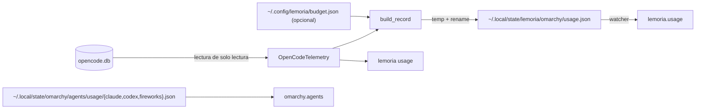

# Gestión de agentes y telemetría

Cómo Lemoria conoce a sus subagentes, cómo se cambia el modelo de cada uno y
cómo se publica el consumo al widget propio de Omarchy sin tocar Codex.

Tres ideas explican casi todo lo de esta página:

1. **El `.md` es la fuente de verdad.** La tabla `agents` es un espejo.
2. **El modelo se hereda, no se supone.** Si el frontmatter no declara `model`,
   opencode usa el de quien invoca. Una columna vacía es el estado normal.
3. **La telemetría no se pide a los agentes.** Ya está en la base de datos de
   opencode; Lemoria la lee de solo lectura.

---

## Por qué el `.md` manda

opencode carga los agentes desde `.opencode/agents/*.md`. Si Lemoria guardara el
modelo solo en PostgreSQL, bastaría con que alguien editara el `.md` a mano para
que la DB dijera una cosa y opencode otra. El orden importa:

```
.opencode/agents/*.md          ← fuente de verdad
        │  lemoria agent sync
        ▼
tabla agents (PostgreSQL)      ← espejo: reporte, vault, atribución
```

`sync` hace *upsert* por nombre y es idempotente: correrlo dos veces sobre los
mismos archivos no cambia nada. Además marca como `active = false` los agentes
cuyo `.md` desapareció — **pero solo los que él mismo escribió** (los que llevan
`config.source == "sync"`). Un agente registrado a mano con `lemoria agent
register` sobrevive aunque no tenga archivo detrás.

```bash
lemoria agent sync --dry-run    # qué cambiaría, sin escribir
```

---

## El modelo: heredado o pineado

OpenCode resuelve el modelo de un subagente así:

```
frontmatter tiene `model:`  →  usa ese modelo          (source: pinned)
frontmatter NO tiene `model:`  →  hereda del invocador  (source: inherits)
```

Los 7 subagentes de Lemoria no declaran modelo, y el orquestador corre en
`big-pickle`. Resultado: los 7 usan `big-pickle`, y `agents.model` es `NULL`
para los 8. **Eso es correcto, no un bug.** Fijar un modelo es opcional y se
decide agente por agente.

### Fijar uno

```bash
lemoria agent model review-agent anthropic/claude-sonnet-4-5
lemoria agent model review-agent anthropic/claude-sonnet-4-5 --variant high
```

Esto escribe en el frontmatter y vuelve a sincronizar:

```yaml
---
description: >-
  Technical review — reviews code, verifies PRD alignment, detects technical
  debt, and validates traceability. Language-agnostic.
mode: subagent
permissions:
  - action: shell
    resource: "*"
    effect: deny
  - action: edit
    resource: "*"
    effect: deny
model: anthropic/claude-sonnet-4-5
variant: high
---
```

La edición del frontmatter es **quirúrgica**: se reescriben solo las líneas
afectadas, nunca se re-serializa el YAML. Eso conserva los escalares plegados
(`>-`), los comentarios y el orden de las claves. La clave nueva se añade al
final del bloque, a columna 0, porque insertarla "después de la última clave de
primer nivel" caería dentro de mappings/listas anidadas como `permissions:` y rompería el
YAML.

`variant` es el reasoning effort. Solo tiene sentido junto a un `model` fijado:
`--variant` sin modelo no hace nada por sí solo.

### Quitar un pin

```bash
lemoria agent model review-agent --clear
```

Borra las claves `model` y `variant` del frontmatter y devuelve el agente a la
herencia. Para volver a consultar el valor actual, el comando sin argumentos:

```bash
lemoria agent model review-agent
# review-agent: inherited (no model in frontmatter)
```

Si el `.md` llegara a quedar a mano, esto es lo que produce `--clear`:

```yaml
model: anthropic/claude-sonnet-4-5
variant: high
```

La API de Python sí expone el borrado explícito, que es lo que cubren los tests:

```python
from lemoria.agents import AgentSync
AgentSync(session, agents_dir).set_model("review-agent", None)   # model=None, variant=None
```

### Ver el estado

```console
$ lemoria agent model review-agent
review-agent: model=anthropic/claude-sonnet-4-5 variant=high

$ lemoria agent model db-agent
db-agent: inherited (no model in frontmatter)
```

---

## Telemetría: la DB de opencode

opencode ya registra cada sesión en
`$XDG_DATA_HOME/opencode/opencode.db`: qué agente la abrió, con qué modelo, el
reparto de tokens y el costo. Pedirle a cada agente que reporte eso otra vez por
el ledger SDD sería duplicar un dato que ya existe y que opencode mantiene
mejor que nosotros.

`OpenCodeTelemetry` lo lee así:

- **Solo lectura.** `mode=ro` + `PRAGMA query_only`, para que una lectura nunca
  bloquee al escritor de opencode ni deje un WAL detrás.
- **Agregación en SQL**, no en Python: el archivo pesa cientos de MB.
- **Columnas detectadas por feature detection.** opencode es dueño de ese
  esquema y puede cambiarlo entre versiones; si falta una columna, el reporte se
  degrada con un motivo legible en vez de reventar el comando.

Los buckets por modelo del panel se calculan sobre la **última semana**, mientras
que los totales (`totalSessions`, `totalTokens`, `totalPrompts`, `totalCost`) son
de todo el historial. Por eso las cifras por modelo del panel no suman el total
histórico: son una ventana móvil.

Una sesión se considera **viva** si fue tocada en los últimos 5 minutos
(`ACTIVE_WINDOW_SECONDS`). opencode no tiene un flag "corriendo", así que la
recencia es la señal honesta.

### El desglose por agente

```console
$ lemoria agent status
agent                  source   model            variant   sess  live    tokens
-------------------------------------------------------------------------------
db-agent               inherits big-pickle       default      0     0         0
documentation-agent    inherits big-pickle       default      9     0      7.9M
frontend-agent         inherits big-pickle       default      4     0      4.3M
github-agent           inherits big-pickle       default      8     0      1.9M
implementation-agent   inherits big-pickle       default     36     0     35.7M
orchestrator           inherits big-pickle       default      6    1*    137.2M
review-agent           inherits big-pickle       default      9     0      2.2M
testing-agent          inherits big-pickle       default      6     0      7.7M
-------------------------------------------------------------------------------
build                  builtin  big-pickle       default      5     0     46.2M
explore                builtin  big-pickle       default      3     0    961.8K
general                builtin  big-pickle       default      3     0      2.5M
plan                   builtin  big-pickle       default      2     0      1.6M

inherits = no model in frontmatter, so opencode uses the calling agent's
builtin   = opencode's own agent, no .md to pin a model on
*         = session updated in the last 5 minutes
```

Lectura de la tabla:

| Columna | Significado |
|---|---|
| `source` | `pinned` / `inherits` (agentes de Lemoria) o `builtin` (los de opencode) |
| `model` | Modelo **efectivo**: el pineado, o el del orquestador si hereda |
| `variant` | Reasoning effort; `default` si no hay |
| `sess` | Sesiones con ese nombre de agente |
| `live` | Sesiones raíz tocadas en los últimos 5 min (`*` marca las vivas) |
| `tokens` | Tokens acumulados, abreviados a K/M/G |

Los agentes gestionados por Lemoria salen primero; los `builtin` de opencode
(`build`, `explore`, `general`, `plan`) después, separados por una línea, porque
aparecen en la telemetría pero no tienen `.md` donde pinear un modelo.

Con `--json` sale lo mismo estructurado, más lo que la tabla no cabe: `cost` por
agente, `inheritsFrom` (el modelo del que hereda) y `observedModel` (el modelo
que opencode realmente usó en la sesión más reciente de ese agente).

```jsonc
{
  "telemetryAvailable": true,
  "telemetryReason": "",
  "orchestratorModel": "big-pickle",
  "agents": [
    {
      "name": "review-agent",
      "role": "Technical review",
      "mode": "subagent",
      "model": null,          // pineado en el frontmatter; null = heredado
      "variant": null,
      "inheritsFrom": "big-pickle",
      "sessions": 9,
      "subagentSessions": 0,  // sesiones lanzadas por otro agente
      "activeSessions": 0,
      "tokens": 2192736,
      "cost": 0.0,
      "observedModel": "big-pickle"
    }
  ]
}
```

`inheritsFrom` junto a `model: null` es la forma programática de preguntar
"¿este agente está pineado?". `subagentSessions` cuenta cuántas de esas sesiones
fueron lanzadas por otro agente (`parent_id IS NOT NULL`).

El payload incluye los `builtin` de opencode (`build`, `plan`, `explore`,
`general`) aunque no tengan fila en la DB ni `.md` que configurar. Para
distinguir los dos grupos, cada entrada trae un booleano `managed`: `true` para
los agentes que Lemoria administra, `false` para los propios de opencode. Un
`builtin` nunca reporta `inheritsFrom`, porque no tiene frontmatter del que
heredar.

---

## El panel de Omarchy

### Record compatible + plugin propio

`lemoria.usage` tiene un record privado. No comparte el directorio de
`omarchy.agents`, porque ese directorio es el contrato del panel nativo
Claude/Codex/Fireworks. QML no lee `opencode.db`: solo observa
`~/.local/state/lemoria/omarchy/usage.json`.



El plugin se copia a `~/.config/omarchy/plugins/lemoria.usage`, que es el
directorio que el catálogo de Omarchy recorre para plugins de usuario. Nada bajo
`/usr/share/omarchy` se toca.

`lemoria omarchy install --interval 1min` no solo copia el plugin: también lo
habilita en la barra cuando el comando `omarchy` está disponible:

```bash
omarchy plugin enable lemoria.usage --after omarchy.agents
```

Si esa activación automática falla, el plugin y el record pueden existir pero no
verse hasta correr ese comando manualmente y recargar la shell/barra.

### El contrato del record

Claves heredadas del contrato de `omarchy.agents` que conservamos por forma:

| Clave | Origen en Lemoria | Ventana |
|---|---|---|
| `ready` | `true` solo si hay sesiones o tokens | — |
| `todayPrompts` | mensajes assistant de hoy | hoy |
| `todaySessions` | sesiones con mensajes hoy | hoy |
| `todayTotalTokens` | tokens de hoy | hoy |
| `todayTokensByModel` | tokens de hoy por modelo | hoy |
| `recentDays` | 7 entradas `{date, messageCount}` | 7 días |
| `modelUsage` | buckets `inputTokens` / `outputTokens` / `cacheReadInputTokens` / `cacheCreationInputTokens` | histórico |
| `totalPrompts` / `totalSessions` | conteos assistant y sesiones | histórico |
| `activeDays` / `activeDates` | fechas con uso | histórico |
| `limits` / `tierLabel` | `[]` y `""` | — |

Claves propias para `lemoria.usage`:

| Clave | Para qué |
|---|---|
| `totalTokens` | total histórico exacto, incluyendo razonamiento |
| `monthTokens` | tokens desde el día 1 local |
| `budget` | `{funded, used, remaining, percent, status}` si hay presupuesto configurado |
| `balance` | `{funded, remaining}` compatible con el medidor de Omarchy |
| `agents[]` | nombre, total, hoy, sesiones, prompts, modelo de display actual/configurado/default, modelo observado histórico, fuente del modelo y reparto por modelo |

En cada agente del record, `model` **no** significa "modelo dominante". Es el
modelo que el panel debe mostrar ahora: el configurado en frontmatter, el default
actual de OpenCode, o el mejor fallback disponible. `observedModel` queda
separado para el dato histórico derivado de uso, `configuredModel` refleja el pin
del `.md` cuando existe, y `modelSource` explica la procedencia (`configured`,
`default`, `inherits-default`, `observed` o `unknown`).

`recentDays[].messageCount` se alimenta con **tokens**, pese al nombre. No es un
error: `Panel.qml` lo renderiza con `formatTokenCount(day.messageCount)` y lo
etiqueta `· N tokens`.

`modelUsage` es **histórico, no una ventana de 7 días**. El manifest del propio
plugin llama a esa sección el "all-time model breakdown", así que recortarla
escondía justamente el dato que existe para mostrar. Los 7 días ya tienen su
sección propia: `recentDays`.

`modelUsage` conserva el contrato de Omarchy y por eso no tiene campo para
razonamiento. Para totales exactos se usa `totalTokens`, `byModel` del CLI y la
propiedad `ModelBucket.tokens`; esos sí incluyen reasoning y por eso sus buckets
cuadran con el total.

### Qué muestra cada UI

| Panel nativo `omarchy.agents` | `lemoria.usage` | CLI |
|---|---|---|
| Tokens por día | Total siempre visible en barra | Todo en texto/JSON |
| Tokens por modelo | Hoy, 7 días y agentes consolidados | Ideal sin Omarchy |
| Sesiones y prompts de hoy | Tabla de todos los agentes conocidos, incluso sin uso | Debug/automatización |
| Días activos | Modelo display + `obs ...` si difiere del histórico | `agent status` detallado |

### Escritura atómica

El panel re-escanea el directorio ante cualquier cambio, así que un archivo a
medias se vería como una pestaña rota. `write_record` escribe a un temporal en el
mismo directorio y hace `replace()`, de modo que el watcher siempre recibe un
documento completo.

---

## El timer

El panel nativo refresca solo sus propios collectors (`claude.json`,
`codex.json`, `fireworks.json`). Lemoria no participa de ese directorio: su
record privado vive en `~/.local/state/lemoria/omarchy/usage.json`. De ahí el
timer propio. Ese mismo tick sanea `codex.json` cuando el collector nativo falla
intermitentemente con `account/read`, preservando el último límite bueno sin
editar `/usr/share/omarchy`.

```bash
lemoria omarchy install --interval 1min  # 1 min, escribe y activa plugin + timer
lemoria omarchy install --interval 30min
lemoria omarchy install --no-enable      # solo escribe plugin, record privado y units
```

Genera dos units de **usuario** (no de sistema, no necesitan root):

`~/.config/systemd/user/lemoria-usage.service`
```ini
[Unit]
Description=Publish lemoria opencode usage to the Lemoria Omarchy plugin

[Service]
Type=oneshot
ExecStart=/ruta/al/lemoria omarchy record
```

`~/.config/systemd/user/lemoria-usage.timer`
```ini
[Unit]
Description=Refresh the Lemoria usage widget

[Timer]
OnBootSec=1min
OnUnitActiveSec=1min
Persistent=true
Unit=lemoria-usage.service

[Install]
WantedBy=timers.target
```

`OnBootSec=1min` cubre el arranque; `Persistent=true` hace que una sesión
apagada se recupere al volver. El `ExecStart` usa la ruta absoluta del CLI
(resuelta con `shutil.which`) porque una unit no corre con shell y no tiene `PATH`
de sesión.

Escribir las units y activarlas son pasos separados: `install_timer()` solo
escribe, y el comando decide si llama a `systemctl --user enable --now`. Con
`--no-enable` no arranca nada.

---

## Troubleshooting: panel invisible

El bug más confuso es que todo esté instalado pero el slot mida `0x0`: Omarchy
registra el plugin, pero la barra no reserva espacio. El `Panel.qml` de Lemoria
ahora expone `implicitWidth`/`implicitHeight` desde el botón y el texto de barra
cae a `0` cuando todavía no hay uso real. El mismo slot reserva su propio margen
derecho para no quedar pegado al icono siguiente de la barra (Bluetooth, etc.)
sin tocar `omarchy.agents`. Por eso el comportamiento esperado es:

- con uso: se ve el total histórico compacto (`12K`, `293M`, etc.);
- sin uso: se ve `0` y el popup muestra "Lemoria usage" con el estado vacío o
  el motivo leído del record (`opencode data unavailable`, permisos, etc.).

Si el panel sigue invisible, verificá de afuera hacia adentro:

```bash
# 1. Está habilitado en la barra de Omarchy.
omarchy plugin enable lemoria.usage --after omarchy.agents
omarchy restart shell  # necesario para ver cambios de layout/márgenes del plugin

# 2. El QML instalado es el plugin propio de Lemoria.
test -f ~/.config/omarchy/plugins/lemoria.usage/Panel.qml
test -f ~/.config/omarchy/plugins/lemoria.usage/Record.qml

# 3. El record privado existe y puede regenerarse.
lemoria omarchy where
test -f ~/.local/state/lemoria/omarchy/usage.json || lemoria omarchy record

# 4. El timer está activo y tiene un próximo disparo.
systemctl --user status lemoria-usage.timer
systemctl --user list-timers lemoria-usage.timer --no-pager
```

No diagnostiques el panel buscando `lemoria.json` en
`~/.local/state/omarchy/agents/usage/`: ese directorio pertenece a
`omarchy.agents`. Si hay un record legado allí, `lemoria omarchy install` lo
borra para conservar aislados Claude/Codex/Fireworks.

Si el plugin ya estaba habilitado y el archivo QML cambió, `rescanPlugins` puede
detectar el plugin pero no refrescar visualmente márgenes o tamaño del botón. Para
cambios de layout (por ejemplo la separación con Bluetooth), reiniciá la shell de
Omarchy con `omarchy restart shell` después de actualizar el plugin.

### Deshacerlo

```bash
systemctl --user disable --now lemoria-usage.timer
rm ~/.config/systemd/user/lemoria-usage.{service,timer}
systemctl --user daemon-reload
```

---

## Referencia rápida

| Comando | Efecto |
|---|---|
| `lemoria agent sync` | Refleja `.opencode/agents/*.md` en la tabla `agents` |
| `lemoria agent sync --dry-run` | Igual, sin escribir |
| `lemoria agent sync --dir PATH` | Lee los `.md` de otro directorio |
| `lemoria agent list` | Agentes registrados |
| `lemoria agent model <name>` | Muestra el modelo actual |
| `lemoria agent model <name> <model>` | Lo fija en el frontmatter |
| `lemoria agent model <name> <model> -v <variant>` | Fija modelo y reasoning effort |
| `lemoria agent status` | Tabla por agente |
| `lemoria agent status --json` | Lo mismo, estructurado, con costo |
| `lemoria omarchy record` | Escribe el record del panel |
| `lemoria omarchy record --print` | Lo muestra sin escribir |
| `lemoria omarchy record -o PATH` | Lo escribe en otro directorio |
| `lemoria omarchy install --interval 1min` | Instala plugin, escribe record, habilita `lemoria.usage` y activa el timer |
| `lemoria omarchy where` | Ruta que el panel vigila |

### Configuración

| Variable | Default | Para qué |
|---|---|---|
| `LEMORIA_OPENCODE_AGENTS_DIR` | `./.opencode/agents` | De dónde lee los `.md` de agentes |

### Esquema

La tabla `agents` tiene dos columnas nuevas:

```python
model   VARCHAR(255) NULL   # NULL = heredado del agente invocador
variant VARCHAR(64)  NULL   # reasoning effort
```

La migración corre en `init_db()` con `ALTER TABLE ... ADD COLUMN IF NOT EXISTS`,
que es idempotente: `create_all()` crea tablas nuevas pero nunca altera una
existente, y `IF NOT EXISTS` hace que repetir `lemoria init` sea inofensivo.
Corre sola en `lemoria init`.

---

## Límites conocidos

- **El modelo efectivo es una atribución, no una medición.** Cuando un agente
  hereda, Lemoria muestra el modelo del orquestador. Si el invocador cambia, la
  columna sigue mostrando el valor leído del último registro de ese agente. El
  campo `observedModel` del `--json` es el dato duro: lo que opencode
  realmente usó.
- **En el record de Omarchy, `model` es display/configuración actual.** El
  histórico derivado de uso vive en `observedModel`; no vuelvas a tratar `model`
  como "modelo dominante".
- **`--dir` solo existe en `sync`.** `agent model` siempre usa
  `LEMORIA_OPENCODE_AGENTS_DIR`. Con la variable apuntando a un directorio
  incompleto, `agent model` sincronizaría solo esos archivos y desactivaría el
  resto; un `lemoria agent sync` a secas lo corrige.
- **`modelUsage` sigue limitado por el contrato de Omarchy.** No tiene campo para razonamiento, pero el record conserva `totalTokens` y `agents[]` para el plugin propio, y el CLI usa `ModelBucket.tokens` para totales exactos.
- **La nota `agents.md` del vault no incluye el modelo.** `export_agents()`
  escribe nombre, rol y descripción. Como los agentes se registran por proyecto
  y los modelos se heredan del invocador, la vista por agente con su modelo
  efectivo vive en `lemoria agent status`, no en Obsidian.
- **`omarchy.agents` queda aislado.** Lemoria no escribe records en su directorio
  nativo; si aparece un `lemoria.json` legado allí, `lemoria omarchy install` lo
  borra para no tocar Claude/Codex/Fireworks.
