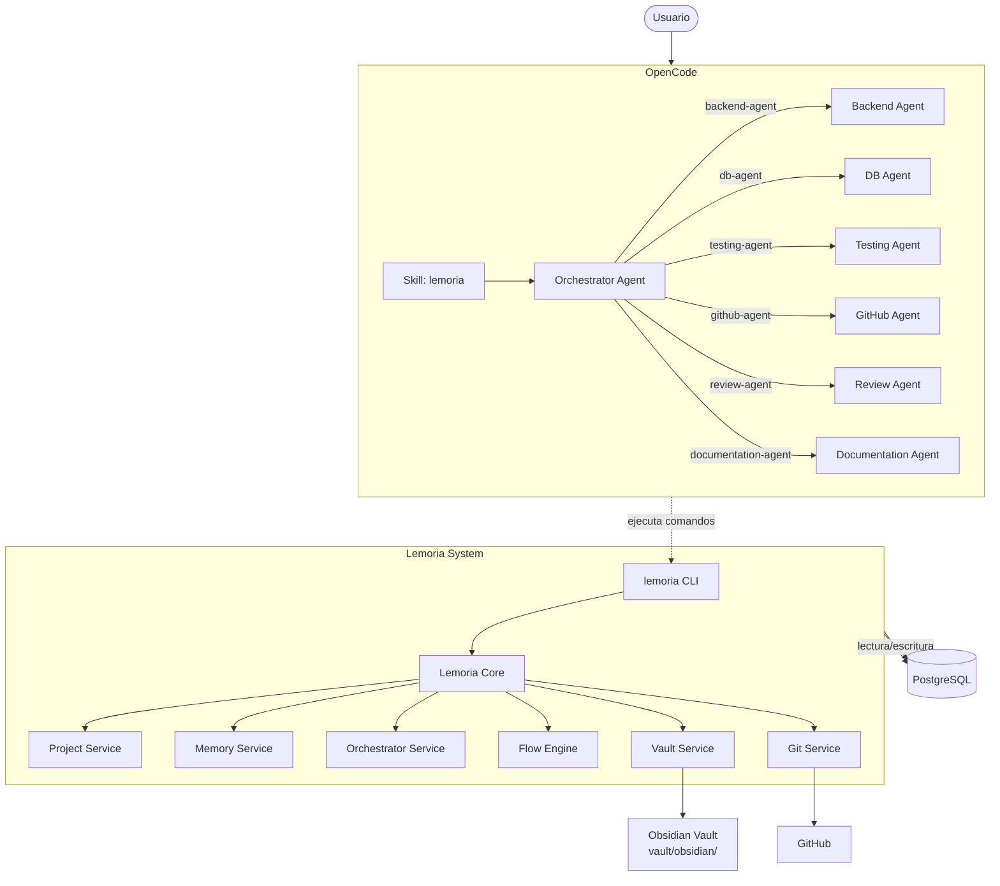
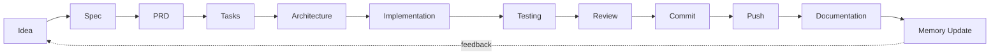
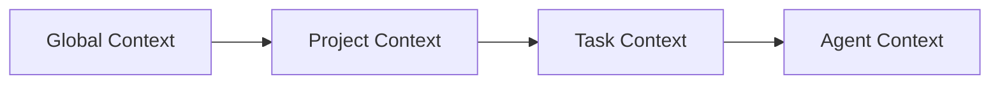
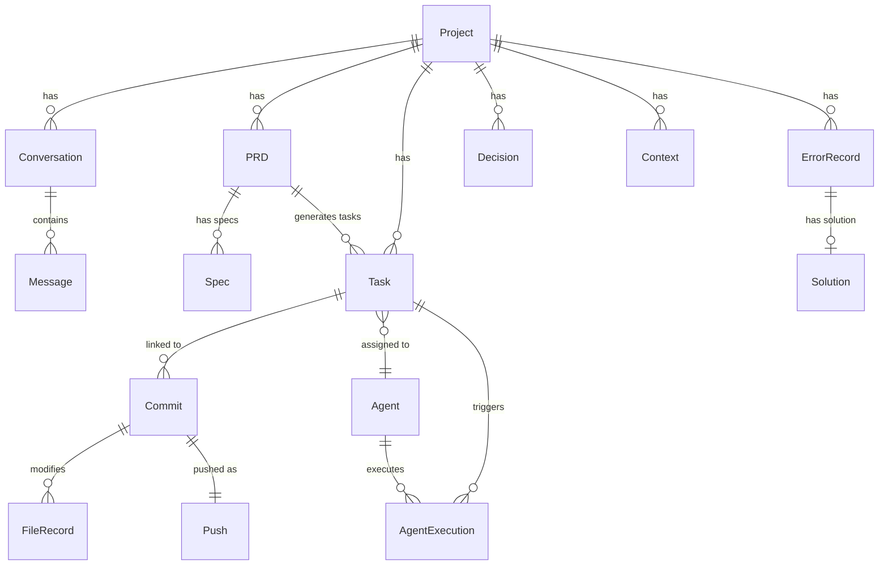
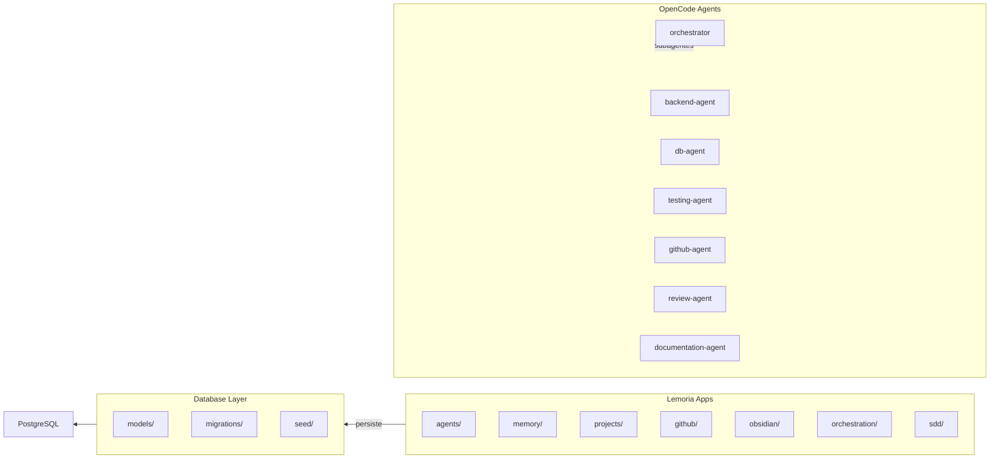

# Arquitectura de Lemoria

## Diagrama de arquitectura



## Diagrama de flujo SDD



## Diagrama de jerarquía de contexto



## Diagrama de entidades



## Diagrama de componentes



## Visión general

```
Usuario
  ↓
Lemoria Orchestrator
  ↓
Context Engine
  ↓
PostgreSQL
  ↓
Subagentes
  ↓
GitHub / Obsidian / Archivos
```

## Componentes

### Lemoria Core
Núcleo que inicia servicios, maneja configuración y administra proyectos.

### Lemoria Memory
Sistema de memoria persistente: conversaciones, PRDs, tareas, decisiones, errores, soluciones.

### Lemoria Orchestrator
Agente mayor que analiza contexto, revisa PRDs, delega tareas y consolida resultados.

### Lemoria Agents
Sistema multiagente especializado: backend, db, testing, documentation, github, review.

### Lemoria Flow
Motor SDD con flujo: Idea → Spec → PRD → Tasks → Architecture → Implementation → Testing → Review → Commit → Push → Documentation → Memory Update.

### Lemoria Vault
Integración con Obsidian para visualización humana y knowledge graph.

### Lemoria Git
Sistema de trazabilidad que registra commits, pushes, ramas y PRs vinculados a tareas.

## Jerarquía de contexto

```
Global Context
  ↓
Project Context
  ↓
Task Context
  ↓
Agent Context
```

Cada agente recibe únicamente el contexto necesario.

## Reglas fundamentales

1. El orquestador debe revisar contexto antes de delegar
2. Toda decisión importante debe registrarse
3. Todo cambio debe tener trazabilidad
4. Los agentes no modifican componentes críticos automáticamente
5. Priorizar contexto útil sobre memoria infinita
