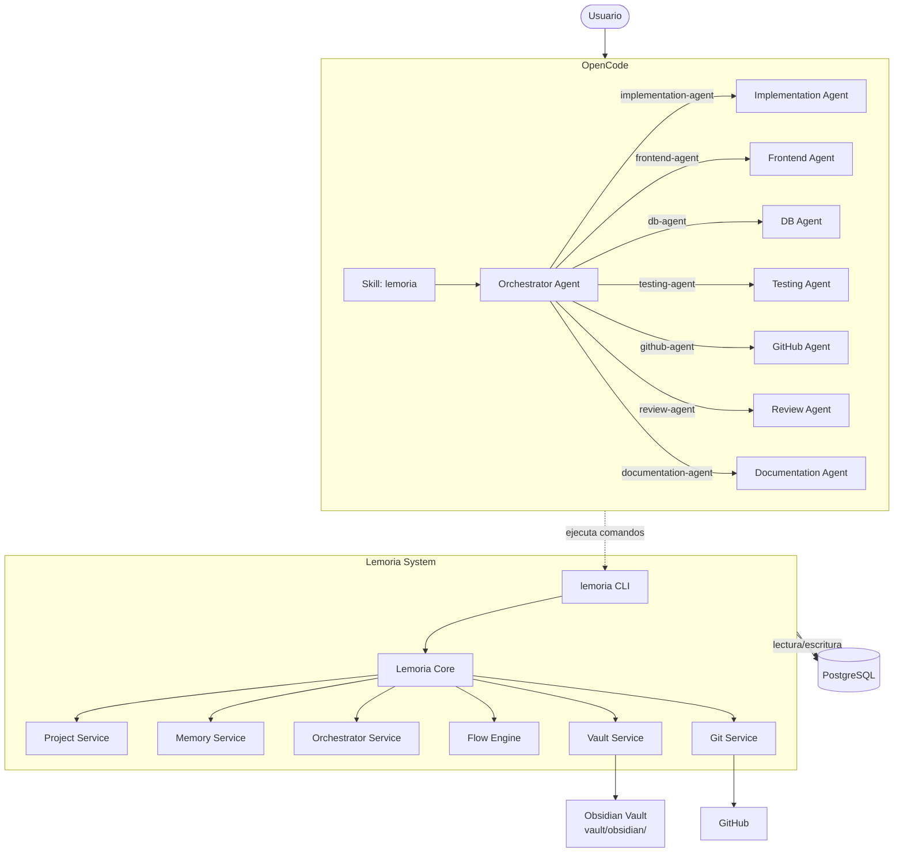
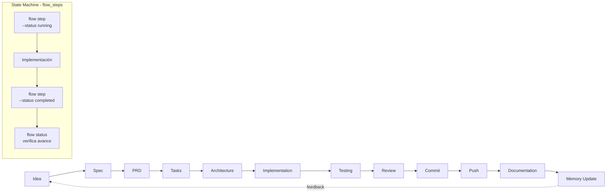
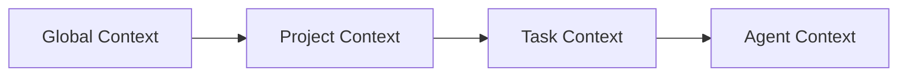
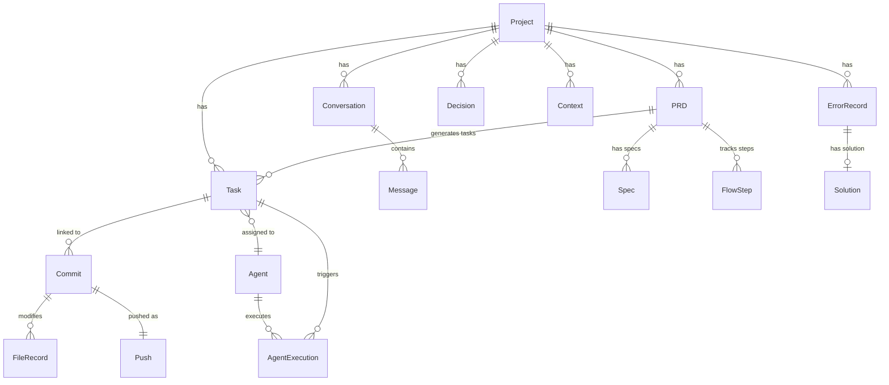
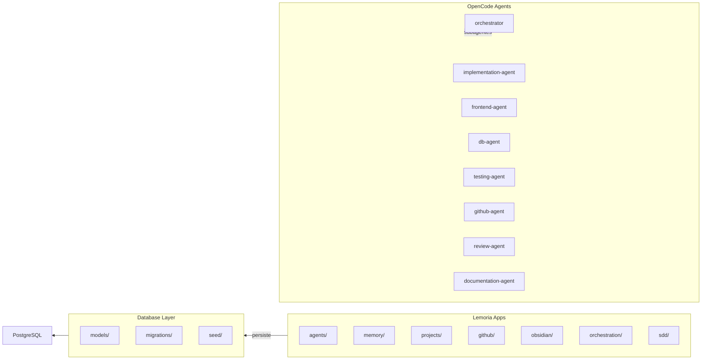

# Arquitectura de Lemoria

## Diagrama de arquitectura



## Diagrama de flujo SDD con State Machine



## Diagrama de jerarquía de contexto



## Diagrama de entidades



## Diagrama de componentes



## Visión general

```
Usuario
  ↓
Lemoria Orchestrator
  ↓
Context Engine
  ↓
PostgreSQL
  ↓
Subagentes
  ↓
GitHub / Obsidian / Archivos
```

## Componentes

### Lemoria Core
Núcleo que inicia servicios, maneja configuración y administra proyectos.

### Lemoria Memory
Sistema de memoria persistente: conversaciones, PRDs, tareas, decisiones, errores, soluciones.

### Lemoria Orchestrator
Agente mayor que analiza contexto, revisa PRDs, delega tareas y consolida resultados.

### Lemoria Agents
Sistema multiagente especializado: implementation, frontend, db, testing, github, review, documentation.

### Lemoria Vault
Integración bidireccional con Obsidian: exporta entidades a markdown con frontmatter (`vault sync`) y reconstruye la DB desde las notas (`vault restore`).

### Lemoria Flow
Motor SDD con state machine. Cada paso del flujo se persiste en `flow_steps` con `flow_id`, `step`, `status`, `started_at`, `completed_at`, `output`. Permite reanudar flujos interrumpidos y ver el progreso completo.

### Lemoria Git
Sistema de trazabilidad que registra commits, pushes, ramas y PRs vinculados a tareas.

### Enums y CheckConstraints
8 enums tipados (`PRDStatus`, `TaskStatus`, `FlowStepStatus`, `DecisionStatus`, `ExecutionStatus`, `SpecStatus`, `CommitFileStatus`, `SolutionOutcome`) con `CheckConstraint` en 7 modelos para integridad de datos a nivel DB.

### Context7 MCP Server
Servidor MCP remoto para consultar documentación en tiempo real de librerías y frameworks. Configurado en `~/.config/opencode/opencode.json`.

## Jerarquía de contexto

```
Global Context
  ↓
Project Context
  ↓
Task Context
  ↓
Agent Context
```

Cada agente recibe únicamente el contexto necesario.

## Reglas fundamentales

1. El orquestador debe revisar contexto antes de delegar
2. Toda decisión importante debe registrarse como ADR
3. Todo cambio debe tener trazabilidad (tarea → commit → push)
4. Todo paso del flujo se persiste como flow step en la DB
5. Commit y Documentation son pasos obligatorios (no se pueden saltar)
6. Los agentes no modifican componentes críticos automáticamente
7. Priorizar contexto útil sobre memoria infinita
