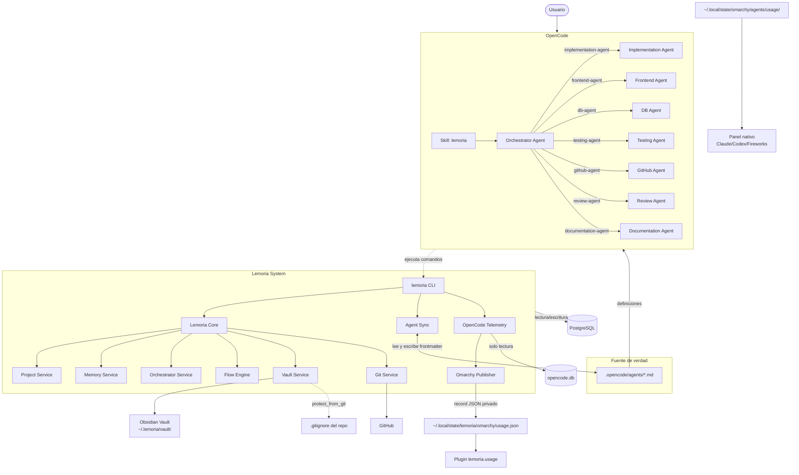
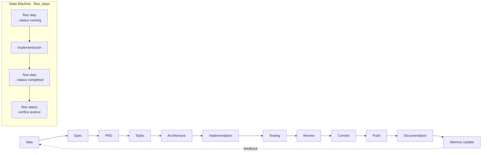
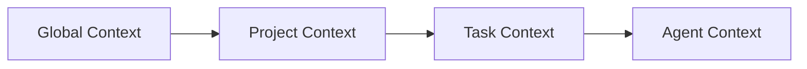
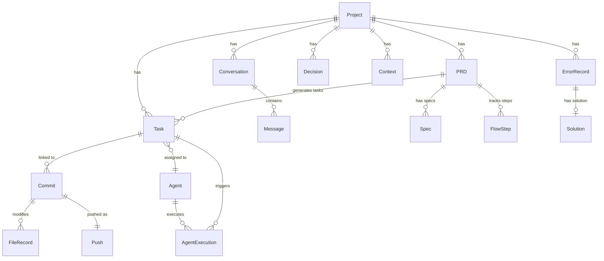
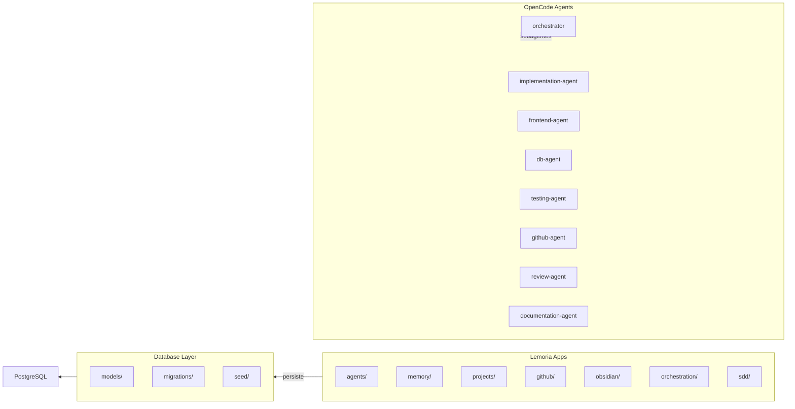

# Arquitectura de Lemoria

## Diagrama de arquitectura


```mermaid
graph TB
  USER([Usuario]) --> OC[OpenCode]

  subgraph OC[OpenCode]
    SKILL[Skill: lemoria] --> OA[Orchestrator Agent]
    OA -->|implementation-agent| IA[Implementation Agent]
    OA -->|frontend-agent| FA[Frontend Agent]
    OA -->|db-agent| DA[DB Agent]
    OA -->|testing-agent| TA[Testing Agent]
    OA -->|github-agent| GA[GitHub Agent]
    OA -->|review-agent| RA[Review Agent]
    OA -->|documentation-agent| DOA[Documentation Agent]
  end

  subgraph LEMORIA[Lemoria System]
    CLI[lemoria CLI] --> CORE[Lemoria Core]
    CORE --> PS[Project Service]
    CORE --> MS[Memory Service]
    CORE --> ORCH[Orchestrator Service]
    CORE --> FE[Flow Engine]
    CORE --> VS[Vault Service]
    CORE --> GS[Git Service]
    CLI --> AS[Agent Sync]
    CLI --> OCS[OpenCode Telemetry]
    OCS --> OP[Omarchy Publisher]
  end

  subgraph MD[Fuente de verdad]
    AGMD[.opencode/agents/*.md]
  end

  AS <-->|lee y escribe frontmatter| AGMD
  AGMD -->|definiciones| OC

  OCS -->|solo lectura| OCDB[("opencode.db")]
  OP -->|record JSON privado| OMREC["~/.local/state/lemoria/omarchy/usage.json"]
  OMREC --> LMPANEL[Plugin lemoria.usage]
  NREC["~/.local/state/omarchy/agents/usage/"] --> OMPANEL[Panel nativo<br/>Claude/Codex/Fireworks]

  LEMORIA --> DB[(PostgreSQL)]
  VS --> OBSIDIAN[Obsidian Vault<br/>~/.lemoria/vault/]
  VS -.->|protect_from_git| GITIGNORE[.gitignore del repo]
  GS --> GITHUB[GitHub]

  OC -.->|ejecuta comandos| CLI
  LEMORIA -->|lectura/escritura| DB
```

## Diagrama de flujo SDD con State Machine


```mermaid
flowchart LR
  A[Idea] --> B[Spec]
  B --> C[PRD]
  C --> D[Tasks]
  D --> E[Architecture]
  E --> F[Implementation]
  F --> G[Testing]
  G --> H[Review]
  H --> I[Commit]
  I --> J[Push]
  J --> K[Documentation]
  K --> L[Memory Update]
  L -.->|feedback| A

  subgraph SM[State Machine - flow_steps]
    S1[flow step<br/>--status running] --> S2[Implementación]
    S2 --> S3[flow step<br/>--status completed]
    S3 --> S4[flow status<br/>verifica avance]
  end
```

## Diagrama de jerarquía de contexto


```mermaid
flowchart LR
  GC[Global Context] --> PC[Project Context]
  PC --> TC[Task Context]
  TC --> AC[Agent Context]
```

## Diagrama de entidades


```mermaid
erDiagram
  Project ||--o{ Conversation : has
  Project ||--o{ PRD : has
  Project ||--o{ Task : has
  Project ||--o{ Decision : has
  Project ||--o{ Context : has
  Project ||--o{ ErrorRecord : has

  Conversation ||--o{ Message : contains
  PRD ||--o{ Spec : "has specs"
  PRD ||--o{ Task : "generates tasks"
  PRD ||--o{ FlowStep : "tracks steps"

  Task ||--o{ Commit : "linked to"
  Task }o--|| Agent : "assigned to"

  Commit ||--o{ FileRecord : modifies
  Commit ||--|| Push : "pushed as"

  ErrorRecord ||--o| Solution : "has solution"

  Agent ||--o{ AgentExecution : executes
  Task ||--o{ AgentExecution : triggers
```

## Diagrama de componentes


```mermaid
graph RL
  subgraph APPS[Lemoria Apps]
    A1[agents/]
    A2[memory/]
    A3[projects/]
    A4[github/]
    A5[obsidian/]
    A6[orchestration/]
    A7[sdd/]
  end

  subgraph DB_LAYER[Database Layer]
    M1[models/]
    M2[migrations/]
    M3[seed/]
  end

  subgraph AGENTS[OpenCode Agents]
    AG1[orchestrator]
    AG2[implementation-agent]
    AG3[frontend-agent]
    AG4[db-agent]
    AG5[testing-agent]
    AG6[github-agent]
    AG7[review-agent]
    AG8[documentation-agent]
  end

  AGENTS -->|subagentes| AG1
  APPS -->|persiste| DB_LAYER
  DB_LAYER --> PostgreSQL
```

## Visión general

```
Usuario
  ↓
Lemoria Orchestrator
  ↓
Context Engine
  ↓
PostgreSQL
  ↓
Subagentes
  ↓
GitHub / Obsidian / Archivos
```

## Componentes

### Lemoria Core
Núcleo que inicia servicios, maneja configuración y administra proyectos.

### Lemoria Memory
Sistema de memoria persistente: conversaciones, PRDs, tareas, decisiones, errores, soluciones.

### Lemoria Orchestrator
Agente mayor que analiza contexto, revisa PRDs, delega tareas y consolida resultados.

### Lemoria Agents
Sistema multiagente especializado: implementation, frontend, db, testing, github, review, documentation.

### Lemoria Vault
Integración bidireccional con Obsidian: exporta entidades a markdown con frontmatter (`vault sync`) y reconstruye la DB desde las notas (`vault restore`).

### Lemoria Flow
Motor SDD con state machine. Cada paso del flujo se persiste en `flow_steps` con `flow_id`, `step`, `status`, `started_at`, `completed_at`, `output`. Permite reanudar flujos interrumpidos y ver el progreso completo.

### Lemoria Git
Sistema de trazabilidad que registra commits, pushes, ramas y PRs vinculados a tareas.

### Lemoria Agents (`agents.py`)
Espejo de `.opencode/agents/*.md` hacia la tabla `agents`. El markdown es la
fuente de verdad y la DB solo lo refleja, así que `sync` es idempotente y la
única escritura hacia el `.md` (fijar `model`/`variant`) edita el frontmatter en
lugar de re-serializarlo. Detalle en [AGENT-MANAGEMENT.md](AGENT-MANAGEMENT.md).

### OpenCode Telemetry (`opencode_telemetry.py`)
Lectura de solo lectura (`mode=ro` + `query_only`) del `opencode.db` de
opencode. Aporta sesiones, tokens y costo por agente sin pedirle nada a los
agentes. Las columnas se detectan por feature detection: si opencode cambia su
esquema, el reporte se degrada con un motivo legible en vez de fallar.

### Omarchy Publisher (`omarchy.py`) y plugin `lemoria.usage`
Traduce la telemetría a un JSON privado para el widget de Lemoria, instala un
timer systemd de usuario que lo refresca, y copia el plugin
QML propio de Lemoria a `~/.config/omarchy/plugins/lemoria.usage`. No toca
`/usr/share/omarchy`: usa el directorio de plugins de usuario que el catálogo de
Omarchy ya recorre.

`lemoria.usage` lee un record privado (`~/.local/state/lemoria/omarchy/usage.json`).
No se escribe en `~/.local/state/omarchy/agents/usage`, que queda reservado para
el panel nativo de Omarchy (Claude/Codex/Fireworks). Si existe un
`lemoria.json` legado en ese directorio, install/uninstall lo eliminan.

La escritura del record privado sigue siendo atómica (tempfile + rename), para
que el watcher reciba siempre un JSON completo.

La visibilidad y separación visual del panel dependen de dos contratos: la
activación del plugin en Omarchy (`omarchy plugin enable lemoria.usage --after
omarchy.agents`) y el tamaño implícito del root QML. `Panel.qml` expone el tamaño
del botón como `implicitWidth`/`implicitHeight`; así la barra no colapsa el slot a
`0x0` cuando el record todavía está vacío. El slot también reserva un pequeño
gap derecho dentro del plugin Lemoria para que su número no invada el icono
siguiente (por ejemplo Bluetooth) sin modificar el panel nativo de Omarchy. En
ese caso el botón muestra `0` y el popup explica el estado en vez de desaparecer.

### Enums y CheckConstraints
8 enums tipados (`PRDStatus`, `TaskStatus`, `FlowStepStatus`, `DecisionStatus`, `ExecutionStatus`, `SpecStatus`, `CommitFileStatus`, `SolutionOutcome`) con `CheckConstraint` en 7 modelos para integridad de datos a nivel DB.

### Context7 MCP Server
Servidor MCP remoto para consultar documentación en tiempo real de librerías y frameworks. Configurado en `~/.config/opencode/opencode.json`.

## Jerarquía de contexto

```
Global Context
  ↓
Project Context
  ↓
Task Context
  ↓
Agent Context
```

Cada agente recibe únicamente el contexto necesario.

## Reglas fundamentales

1. El orquestador debe revisar contexto antes de delegar
2. Toda decisión importante debe registrarse como ADR
3. Todo cambio debe tener trazabilidad (tarea → commit → push)
4. Todo paso del flujo se persiste como flow step en la DB
5. Commit y Documentation son pasos obligatorios (no se pueden saltar)
6. Los agentes no modifican componentes críticos automáticamente
7. Priorizar contexto útil sobre memoria infinita
